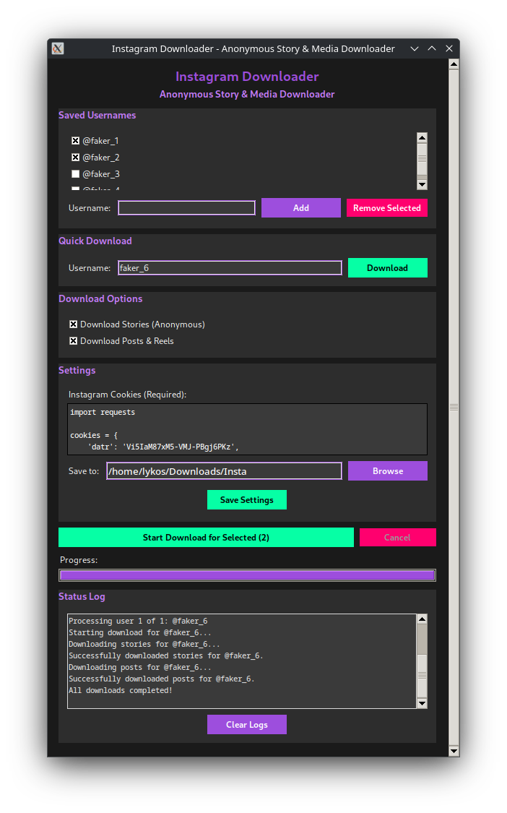

# Instagram Downloader: Anonymous Story & Media Downloader

A GUI-based Instagram media downloader built with Python and Tkinter that allows you to **anonymously download stories without marking them as seen** and download content from both public and private accounts (if you're a follower).

## Key Features

- **Anonymous Story Downloads**: Download Instagram stories without marking them as "seen" - maintain your privacy
- **Private Account Support**: Download from private accounts you follow using your cookies
- **Public Content Access**: Download posts, reels, IGTV, and profile pictures from public accounts without login
- **User-friendly GUI**: Clean and intuitive interface built with Tkinter
- **Bulk Downloads**: Save multiple usernames and download from all selected profiles
- **Quick Download**: Download from a single username without saving it
- **Flexible Options**: Choose to download stories, posts, or both
- **Persistent Settings**: Automatically saves your configuration including usernames, cookies, and download path
- **Cookie Support**: Multiple cookie format support (Python dict, JSON, semicolon-separated)
- **Cross-platform**: Works on Windows, macOS, and Linux

## What Makes This Special

### Anonymous Story Viewing
Unlike viewing stories directly on Instagram (which marks them as "seen"), this tool downloads stories without any interaction with Instagram's viewing system. Your story views remain completely anonymous.

### Private Account Access
If you follow a private Instagram account, you can use your login cookies to download their content - stories, posts, and more - all while maintaining anonymity.

### No Cookies Needed for Public Content
Download posts, reels, IGTV videos, and profile pictures from public accounts without any authentication required.

## Screenshots



## Installation

### Prerequisites

- Python 3.7 or higher
- pip (Python package installer)

### Steps

1. Clone the repository:
```bash
git clone https://github.com/yourusername/instagram-downloader.git
cd instagram-downloader
```

2. Install required dependencies:
```bash
pip install -r requirements.txt
```

## Usage

### Running the Application

```bash
python gui.py
```

### Setting up Cookies (Required for Stories & Private Accounts)

To download stories anonymously or access private accounts, you need to provide your Instagram cookies:

1. **Open Chrome and log into Instagram**
2. **Right-click anywhere and select "Inspect"** (or press F12)
3. **Go to the "Network" tab**
4. **Refresh the page**
5. **Find any request to instagram.com**
6. **Right-click on the request and select "Copy as cURL"**
7. **Use a cURL to Python converter** to extract cookies
8. **Paste the cookies in the Settings section** of the application

**Supported cookie formats:**
- Python dictionary: `{'sessionid': 'value', 'csrftoken': 'value', ...}`
- JSON format: `{"sessionid": "value", "csrftoken": "value", ...}`
- Semicolon-separated: `sessionid=value; csrftoken=value; ...`

**Important cookies needed:**
- `sessionid` - Most important for authentication
- `csrftoken` - Required for API calls
- `ds_user_id` - Your user ID
- `rur` - Routing information

### Adding Usernames

1. **Saved Usernames**: Add usernames to your saved list for regular downloads
   - Enter username in the "Username" field
   - Click "Add" to save it
   - Select checkboxes next to usernames you want to download

2. **Quick Download**: Download immediately without saving the username
   - Enter username in the Quick Download section
   - Click "Download"

### Download Options

- **Download Stories**: Downloads Instagram stories **anonymously** (won't mark as seen)
- **Download Posts**: Downloads regular posts, reels, IGTV videos
- You can select both options to download all available content

### Configuration

The application saves your settings in `config.json`:
- Cookies for authentication
- Saved usernames list
- Download directory path

## File Structure

```
instagram-downloader/
├── gui.py              # Main GUI application
├── downloader.py       # Core download functionality
├── config.json         # Configuration file (auto-generated)
├── requirements.txt    # Python dependencies
└── README.md          # This file
```

## Dependencies

- [instacapture](https://pypi.org/project/instacapture/) - Instagram media capture library
- tkinter - GUI framework (included with Python)

## Important Notes

### Privacy & Anonymity
- **Anonymous Story Viewing**: Stories are downloaded without marking them as "seen"
- **No Direct Interaction**: The tool doesn't interact with Instagram's viewing/engagement systems
- **Cookie Security**: Keep your cookies secure as they contain your login information

### Access Requirements
- **Stories & Private Accounts**: Requires valid Instagram cookies from your logged-in session
- **Public Posts/Reels**: No authentication needed
- **Private Account Access**: You must be a follower of the private account

### Legal and Ethical Considerations
- **Respect Privacy**: Only download content you have permission to access
- **Terms of Service**: Be aware that downloading Instagram content may violate Instagram's ToS
- **Copyright**: Respect copyright laws and only download content you have rights to use
- **Rate Limiting**: The tool respects Instagram's rate limits to avoid account restrictions

### Security
- Your cookies contain sensitive authentication information
- Keep your `config.json` file secure and don't share it
- Consider the security implications of storing cookies in plain text
- Cookies may expire and need to be refreshed periodically

## Troubleshooting

### Common Issues

1. **"Could not parse cookies" error**
   - Ensure cookies are in the correct format
   - Check that all required cookies (especially `sessionid`) are present
   - Try refreshing your browser cookies

2. **Stories not downloading**
   - Verify your cookies are still valid (they may expire)
   - Ensure you have access to the account's stories
   - Check that the user has active stories

3. **Private account access denied**
   - Confirm you're following the private account
   - Verify your cookies are current and valid
   - Try refreshing your Instagram session

4. **Download fails**
   - Verify the username exists and is accessible
   - Check your internet connection
   - Ensure cookies are still valid

### Getting Help

If you encounter issues:
1. Check the status log in the application for detailed error messages
2. Ensure you have the latest version of instacapture
3. Verify your cookies are up to date
4. Open an issue on GitHub with details about the problem

## Contributing

Contributions are welcome! Please feel free to submit a Pull Request. For major changes, please open an issue first to discuss what you would like to change.

### Development Setup

1. Fork the repository
2. Create a feature branch (`git checkout -b feature/new-feature`)
3. Make your changes
4. Test your changes thoroughly
5. Commit your changes (`git commit -m 'Add some new feature'`)
6. Push to the branch (`git push origin feature/new-feature`)
7. Open a Pull Request

## License

This project is licensed under the MIT License - see the [LICENSE](LICENSE) file for details.

## Credits

- Built with Python and Tkinter
- Uses [instacapture](https://pypi.org/project/instacapture/) library for Instagram media downloading
- Powered by anonymous Instagram API interactions

## Disclaimer

This tool is for educational and personal use only. It allows anonymous viewing of Instagram content without marking stories as "seen" and accessing content from accounts you have permission to view. The developers are not responsible for any misuse of this application. Users are responsible for complying with Instagram's Terms of Service and applicable laws regarding data downloading and privacy.

**Use responsibly and respect content creators' rights and privacy.**

## Changelog

### v1.0.0
- Initial release
- Anonymous story downloading capability
- Private account support with follower access
- GUI interface with Tkinter
- Support for downloading stories and posts without marking as seen
- Bulk download functionality
- Configuration persistence